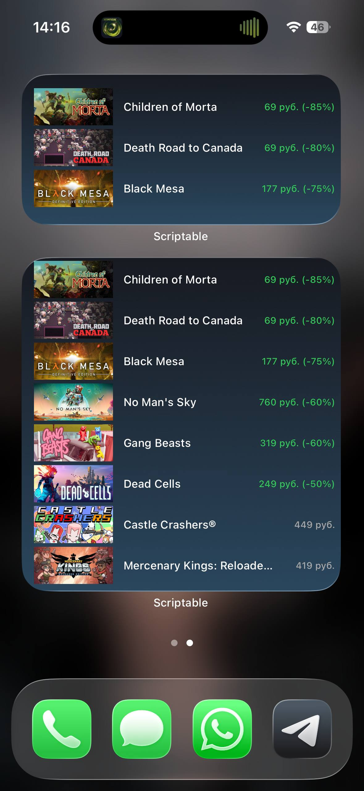
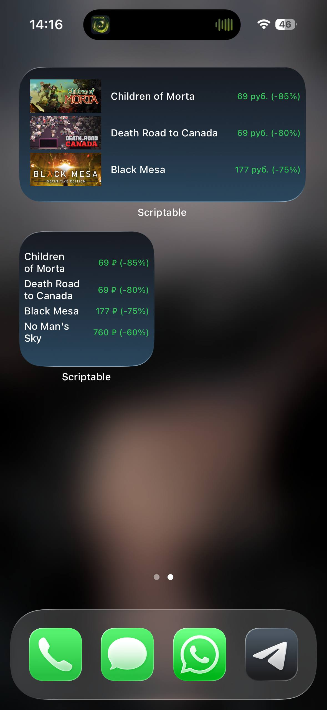

# Scriptable Widgets Collection

Красивая коллекция мощных и полностью готовых к использованию виджетов для приложения **Scriptable** на iOS/iPadOS.

## Что такое Scriptable?
Scriptable — бесплатное приложение, позволяющее писать JavaScript-код прямо на iPhone/iPad и создавать кастомные виджеты, уведомления и автоматизации.

## Установка
1. Установите [Scriptable](https://apps.apple.com/app/scriptable/id1405459188) из App Store  
2. Скопируйте код нужного скрипта из этого репозитория в новый скрипт в приложении  
3. Добавьте виджет на домашний экран или экран блокировки — всё заработает сразу

## Виджеты в репозитории

### Crypto Price Pro
**Файл:** `Crypto Price.scriptable`

Самый продвинутый открытый крипто-виджет для Scriptable:  
• Две колонки • Полноценный портфель • Уведомления • Поиск и добавление любых монет • Меню настроек прямо в приложении • Красивые иконки и кэш

Работает через публичный CoinGecko API — ключ не нужен.

### Steam Wishlist
**Файл:** `Steam Wishlist.scriptable`

Показывает игры из вашего Steam-вишлиста с актуальными ценами и скидками.  
Поддерживает все размеры виджетов (small / medium / large / lockscreen).  
Автоматически сортирует по размеру скидки — самые жирные сейлы всегда сверху!

Требуется Steam API Key и ваш SteamID64.

### Server Status
**Файл:** `Server status.scriptable`

Мониторит доступность ваших серверов, сайтов, NAS, Minecraft-серверов и т.д.  
Зелёный — онлайн, красный — офлайн. Обновляется каждые 5 минут.

Просто добавьте свои URL в массив в начале скрипта.

## Скриншоты

<b>Crypto Price Pro</b> — нажми, чтобы посмотреть

 

<b>Steam Wishlist</b> — нажми, чтобы посмотреть

 

  

  

Готово!  
Залей этот текст в README.md — всё сразу будет красиво, компактно и с раскрывающимися галереями.
